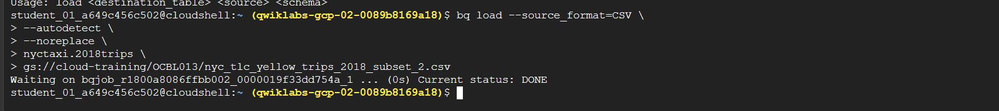
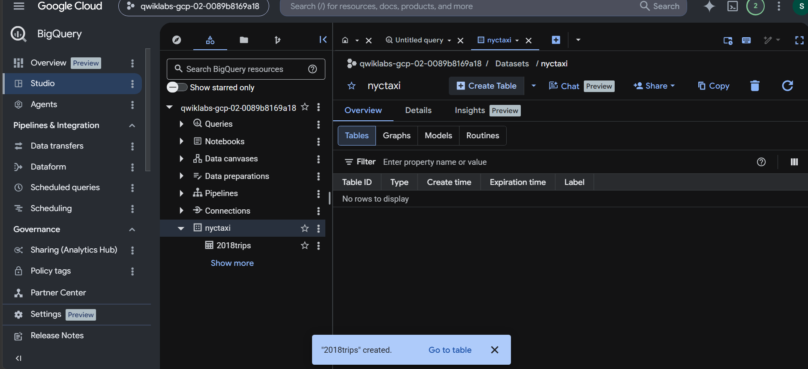
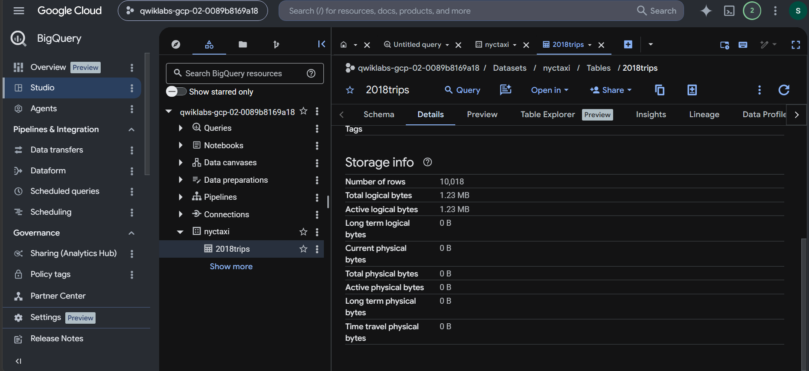
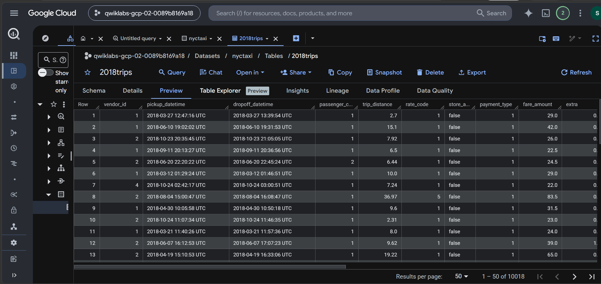
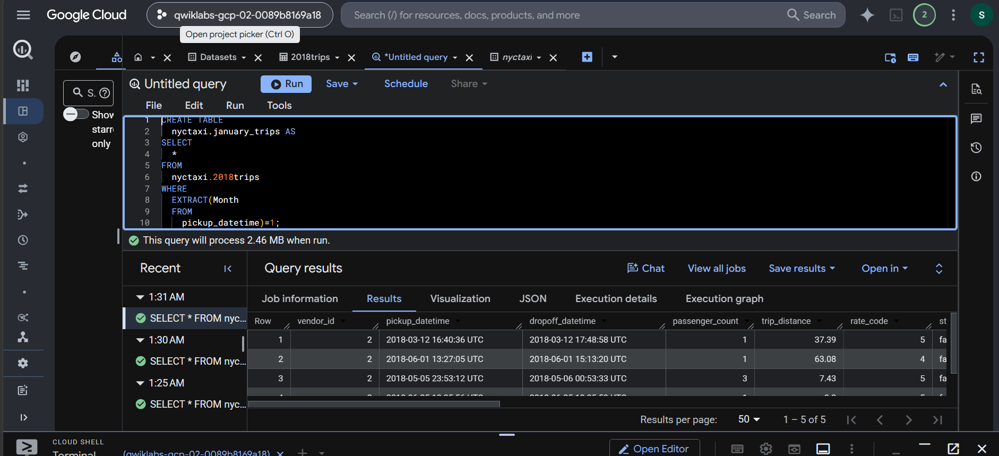
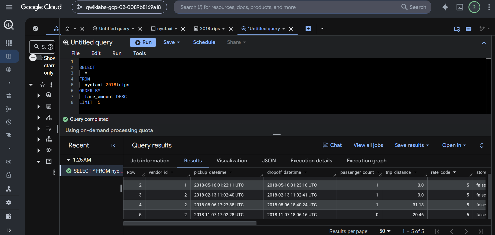

# <div align="center"> Google Cloud BigQuery Data Ingestion Lab </div>

Welcome to the **BigQuery Data Ingestion Lab** repository. This guide walks you through the process of loading CSV data from Google Cloud Storage into BigQuery, managing table metadata, and executing SQL analytics. 

As a data engineer on Google Cloud, efficiently ingesting external datasets and executing scalable queries is a core competency. This repository showcases exactly how to establish a basic data ingestion pipeline using `bq` command-line tools.

---

## 🏗️ Repository Structure

All architectural and visual validation assets are stored securely:
- 📁 **`images/`** - Screenshots demonstrating terminal commands, BigQuery console states, and query outputs.

---

## 🔑 Key Concepts

> [!IMPORTANT]
> - BigQuery provides serverless data warehousing capabilities. Data can be loaded via the Cloud Console, API, or the `bq` command-line tool.
> - When loading CSV files from Google Cloud Storage (GCS) `gs://` buckets, schema auto-detection can be leveraged, but explicit schemas ensure better data consistency.

### Prerequisites

To execute these operations, you must have the `roles/bigquery.dataEditor` or `roles/bigquery.admin` IAM role.

---

## 🚀 Step-by-Step Walkthrough

### Step 1: Loading Data into BigQuery

Load external CSV data from a Google Cloud Storage bucket into a BigQuery table using the command line.

```bash
bq load \
  --source_format=CSV \
  --autodetect \
  nyctaxi.2018trip \
  gs://cloud-training/tutorials/bq/nyc_taxi/2018_trips.csv
```

<p align="center">
  
</p>

---

### Step 2: Validating Uploaded Tables

Once the loading process is complete, navigate to the BigQuery console to confirm the tables have been created successfully.

> [!NOTE]
> BigQuery tables can take a few moments to become fully queryable after bulk data load operations.

<p align="center">
  
</p>

---

### Step 3: Exploring Table Metadata and Schema

Review the table metadata to understand the schema inferred from the CSV data.

<p align="center">
  
</p>

You can also preview the data natively inside the console to verify row integrity before executing analytical workloads.

<p align="center">
  
</p>

---

### Step 4: Executing SQL Queries

With the data successfully loaded, you can now run scalable SQL analytics.

#### 1. January Trips Analysis

Run a query against the newly populated tables to filter trip records for January.

```sql
SELECT
  *
FROM
  `nyctaxi.2018trip`
WHERE
  EXTRACT(MONTH FROM pickup_datetime) = 1
LIMIT 1000;
```

<p align="center">
  
</p>

#### 2. Querying Trips with Fares Less Than $5

Extract insights by filtering trips where the total fare amount was less than $5.

> [!TIP]
> Use `LIMIT` clauses during exploration to reduce the amount of data scanned, saving costs in BigQuery's on-demand pricing model.

```sql
SELECT
  *
FROM
  `nyctaxi.2018trip`
WHERE
  fare_amount < 5
LIMIT 1000;
```

<p align="center">
  
</p>

---
